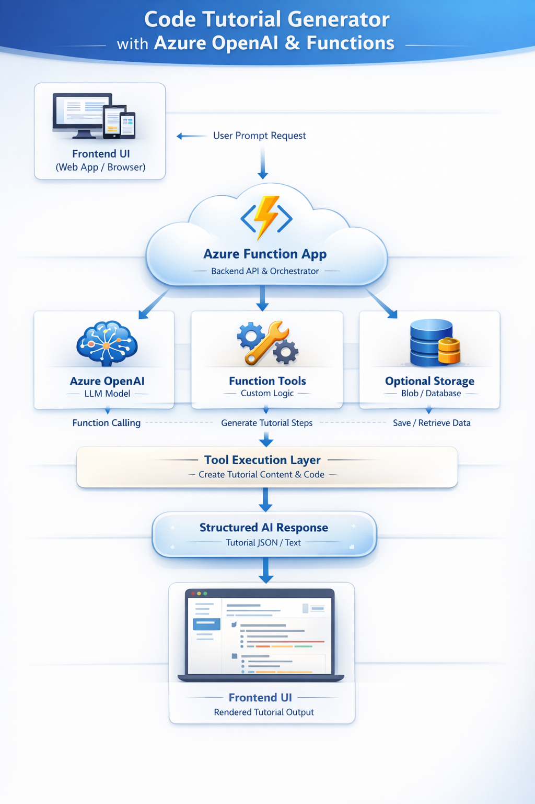

# Code Tutorial Generator (Azure Functions + Azure OpenAI)

A serverless AI-powered application that converts code snippets into beginner-friendly tutorials using **Azure Functions** and **Azure OpenAI (Foundry)**.

---

## Overview

This project demonstrates how to build a cloud-native backend that:

* Accepts code as input
* Sends it to an AI model
* Returns a structured explanation/tutorial

---

## Architecture



---


## Screenshots


---


## Features

* Serverless backend using Azure Functions
* AI-powered code explanation
* HTTP API endpoint for easy integration
* Supports any programming language input

---

## Project Structure

```
function_app/
│
├── CodeTutorial/
│   ├── __init__.py
│   └── function.json
│
├── host.json
├── requirements.txt
```

---

## Environment Variables

Set these in Azure Function App → Configuration:

```
AZURE_OPENAI_API_KEY=your_api_key
AZURE_OPENAI_ENDPOINT=https://<your-resource>.services.ai.azure.com/api/projects/<project>/openai/v1
AZURE_OPENAI_DEPLOYMENT=gpt-4.1
```

---

## Deployment

### 1. Create ZIP package

```bash
zip -r function.zip .
```

### 2. Deploy to Azure

```bash
az functionapp deployment source config-zip \
  --resource-group <your-rg> \
  --name <your-function-app> \
  --src function.zip
```

---

## API Usage

### Endpoint

```
POST /api/CodeTutorial
```

### Example Request

```bash
curl -X POST https://<your-app>.azurewebsites.net/api/CodeTutorial?code=<FUNCTION_KEY> \
  -H "Content-Type: application/json" \
  -d '{"code":"def add(a,b): return a+b"}'
```

---

### Example Response

```json
{
  "tutorial": "This code defines a function..."
}
```

---

## Simple UI (Optional)

You can create a basic frontend using HTML + JavaScript to call the API and display results.

---

## Tech Stack

* Azure Functions (Python)
* Azure OpenAI (Foundry)
* OpenAI Python SDK
* HTTP Trigger API

---

## Learning Outcomes

* Serverless application development on Azure
* Integrating AI models into backend APIs
* Handling HTTP requests and JSON responses
* Using Azure OpenAI deployments

---

## Status

✅ Function deployed
✅ AI integration working
✅ API tested successfully

---

## Reference

Based on:
https://github.com/mzazon/cloud-projects/blob/main/azure/code-tutorial-generator-openai-functions/code-tutorial-generator-openai-functions.md

---

## Author

Antriksh
